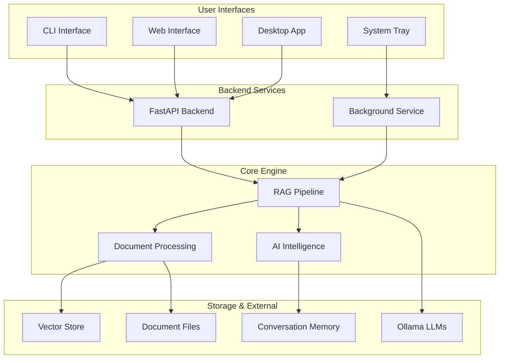

# Orion - Enterprise RAG Platform

<div align="center">

[](https://www.python.org/downloads/)
[](https://fastapi.tiangolo.com/)
[](https://github.com/Ralf090102/Orion)
[](https://github.com/psf/black)
[](https://opensource.org/licenses/MIT)

*A powerful, modular Retrieval-Augmented Generation (RAG) system with multi-user support, advanced document processing, and enterprise-grade architecture.*

</div>

## Key Features

### 🏗️ **Modular Architecture**
- **Core RAG Engine**: Sophisticated document processing and retrieval
- **FastAPI Backend**: RESTful API with async processing
- **System Tray Service**: Background document monitoring
- **Desktop Integration**: Cross-platform desktop application (Tauri)
- **Multi-User Support**: Isolated workspaces for different users

### 📄 **Advanced Document Processing**
- **Multi-Format Support**: PDF, DOCX, Excel, TXT, CSV, MD, RTF, and more
- **OCR Integration**: Extract text from images using EasyOCR/Tesseract
- **Table Extraction**: Advanced PDF table processing with Camelot/Tabula
- **Media Intelligence**: Smart image and document analysis
- **Incremental Updates**: Only process changed documents

### 🧠 **Intelligent Query Processing**
- **Query Enhancement**: HyDE, query expansion, and decomposition
- **Context-Aware Retrieval**: Smart document ranking and re-ranking
- **Conversation Memory**: Persistent chat sessions with context
- **Multi-Query Processing**: Parallel query execution for better results

### ⚡ **Performance & Scalability**
- **Async Processing**: High-performance document ingestion
- **Smart Caching**: LRU caching for embeddings and queries  
- **Background Processing**: Non-blocking document updates
- **Resource Management**: Efficient memory and CPU utilization

## 🚀 Quick Start

### Prerequisites

1. **Install Ollama**: Download from [ollama.ai](https://ollama.ai)
2. **Install Required Models**:
   ```bash
   ollama pull mistral:latest
   ollama pull nomic-embed-text:latest
   ```

### Installation

```bash
# Clone the repository
git clone https://github.com/Ralf090102/Orion.git
cd Orion

# Create virtual environment (recommended)
python -m venv .venv
source .venv/bin/activate  # On Windows: .venv\Scripts\activate

# Install dependencies
pip install -r requirements.txt

# Install in development mode
pip install -e .
```

### Usage Options

#### 🖥️ **CLI Interface** (Legacy)
```bash
# Interactive mode with enhanced features
python run.py

# Or use the new modular CLI
python run_new.py --mode cli
```

#### 🌐 **Web API**
```bash
# Start FastAPI backend server
python run_new.py --mode backend

# Access API documentation at: http://localhost:8000/docs
```

#### 📱 **System Tray Service**
```bash
# Run as background service with system tray
python run_new.py --mode tray
```

#### 🖱️ **Desktop Application**
```bash
# Launch cross-platform desktop app
python run_new.py --mode desktop
```

## � API Documentation

### REST API Endpoints

Once the backend is running (`python run_new.py --mode backend`), you can access:

- **📖 Interactive Docs**: http://localhost:8000/docs
- **📋 OpenAPI Schema**: http://localhost:8000/openapi.json

### Core Endpoints

#### 📥 Document Ingestion
```http
POST /api/v1/ingest
Content-Type: multipart/form-data

{
  "files": [<file1>, <file2>, ...],
  "user_id": "user123",
  "options": {
    "chunk_size": 1000,
    "chunk_overlap": 200,
    "use_async": true
  }
}
```

#### 💬 Query Processing
```http
POST /api/v1/query
Content-Type: application/json

{
  "question": "What are the main findings?",
  "user_id": "user123",
  "options": {
    "use_enhancement": true,
    "retrieval_k": 5,
    "model": "mistral:latest"
  }
}
```

#### 📊 System Status
```http
GET /api/v1/system/health
GET /api/v1/system/stats
GET /api/v1/system/models
```

## 🔧 Configuration

### Environment Variables

```bash
# Core Settings
export ORION_EMBEDDING_MODEL="nomic-embed-text:latest"
export ORION_LLM_MODEL="mistral:latest" 
export ORION_OLLAMA_BASE_URL="http://localhost:11434"

# Performance Settings
export ORION_CHUNK_SIZE=1000
export ORION_CHUNK_OVERLAP=200
export ORION_RETRIEVAL_K=5
export ORION_TEMPERATURE=0.7

# Advanced Features
export ORION_ENABLE_OCR=true
export ORION_ENABLE_TABLE_EXTRACTION=true
export ORION_ASYNC_PROCESSING=true
export ORION_CACHE_SIZE=1000

# Multi-User Settings
export ORION_DEFAULT_USER_ID="default"
export ORION_PERSIST_PATH="./vectorstore"
```

### Advanced Configuration

Create a custom `config.yaml`:

```yaml
# Core RAG Settings
rag:
  chunk_size: 1000
  chunk_overlap: 200
  retrieval_k: 5
  temperature: 0.7

# Model Settings  
models:
  embedding: "nomic-embed-text:latest"
  llm: "mistral:latest"
  ollama_url: "http://localhost:11434"

# Processing Features
features:
  ocr_enabled: true
  table_extraction: true
  async_processing: true
  query_enhancement: true

# Performance
performance:
  cache_size: 1000
  max_workers: 4
  timeout_seconds: 300

# Storage
storage:
  base_path: "./vectorstore"
  backup_enabled: true
  compression: true
```

## 🏗️ Architecture

### Modular Design



### Directory Structure

```
Orion/
├── 🏠 Root Configuration
│   ├── pyproject.toml          # Project configuration
│   ├── requirements.txt        # Dependencies
│   └── run_new.py             # Multi-mode launcher
│
├── 🧠 core/                   # Core RAG Engine
│   ├── rag/                   # RAG Components
│   │   ├── ingest.py          # Document ingestion
│   │   ├── query.py           # Query processing  
│   │   ├── llm.py            # LLM integration
│   │   ├── chat.py           # Chat sessions
│   │   └── ...               # Query enhancement, memory
│   ├── processing/            # Document Processing
│   │   ├── chunking.py       # Smart chunking
│   │   ├── media_processing.py # OCR & tables
│   │   └── document_intelligence.py # AI analysis
│   └── utils/                 # Utilities
│       ├── config.py         # Configuration
│       ├── orion_utils.py    # Core utilities
│       └── caching.py        # Smart caching
│
├── 🌐 backend/               # FastAPI Backend
│   ├── api/                  # REST Endpoints
│   │   ├── ingest.py         # Ingestion API
│   │   ├── query.py          # Query API
│   │   └── system.py         # System API
│   ├── services/             # Business Logic
│   └── main.py              # FastAPI app
│
├── 🖥️ frontend/              # Svelte Frontend
│   ├── src/                  # Svelte components
│   └── public/              # Static assets
│
├── 📱 system_tray/           # Background Service
│   └── service.py           # System tray integration
│
├── 🖱️ desktop/               # Tauri Desktop App
│   ├── src-tauri/           # Rust backend
│   └── src/                 # Web frontend
│
└── 🧪 tests/                # Comprehensive Tests
    ├── test_*.py           # Unit tests
    └── conftest.py         # Test configuration
```

## 🧪 Testing & Development

### Running Tests

```bash
# Run all tests
pytest

# Run with coverage
pytest --cov=core --cov=backend

# Run specific test categories
pytest -m unit          # Unit tests only
pytest -m integration   # Integration tests only
pytest -m "not slow"    # Exclude slow tests

# Run with detailed output
pytest -v --tb=short
```

### Development Setup

```bash
# Install development dependencies
pip install -r requirements-dev.txt

# Install pre-commit hooks
pre-commit install

# Run code formatting
black core/ backend/ tests/
ruff check --fix core/ backend/ tests/

# Type checking
mypy core/ backend/
```

### Code Quality

This project maintains high code quality standards:

- **🔧 Black**: Code formatting
- **⚡ Ruff**: Fast Python linter
- **🔍 MyPy**: Static type checking
- **🧪 Pytest**: Comprehensive test suite (116+ tests)
- **📊 Coverage**: Code coverage tracking

## 🛠️ Supported Features

### 📄 Document Types

| Format | Extension | Features |
|--------|-----------|----------|
| **PDF** | `.pdf` | ✅ Text extraction, ✅ OCR, ✅ Table extraction |
| **Word** | `.docx` | ✅ Full document parsing, ✅ Metadata |
| **Excel** | `.xlsx`, `.xls` | ✅ Multi-sheet support, ✅ Formulas |
| **Text** | `.txt`, `.md`, `.rtf` | ✅ Plain text, ✅ Markdown parsing |
| **Images** | `.jpg`, `.png`, `.tiff` | ✅ OCR text extraction |
| **CSV** | `.csv` | ✅ Structured data processing |

### 🧠 AI Capabilities

- **Query Enhancement**: HyDE, expansion, decomposition
- **Context Resolution**: Smart document ranking
- **Conversation Memory**: Persistent chat history
- **Multi-Query Processing**: Parallel query execution
- **Semantic Chunking**: Intelligent text splitting
- **Cross-Encoder Re-ranking**: Advanced result scoring

### ⚡ Performance Features

- **Async Processing**: Non-blocking operations
- **Smart Caching**: LRU cache for embeddings and queries
- **Incremental Updates**: Only process changed files
- **Background Processing**: System tray monitoring
- **Resource Management**: Memory and CPU optimization

## 🔍 Troubleshooting

### Common Issues

#### 🔧 **Ollama Connection Issues**
```bash
# Start Ollama service
ollama serve

# Check if models are available
ollama list

# Pull required models
ollama pull mistral:latest
ollama pull nomic-embed-text:latest
```

#### 📝 **Import/Module Errors**
```bash
# Ensure proper installation
pip install -e .

# Check Python path
python -c "import sys; print('\n'.join(sys.path))"

# Verify core modules
python -c "from core.rag.query import query_knowledgebase; print('✅ Imports OK')"
```

#### 💾 **Memory Issues**
```bash
# Reduce chunk size for large documents
export ORION_CHUNK_SIZE=500

# Limit concurrent processing
export ORION_MAX_WORKERS=2

# Enable incremental processing
export ORION_ASYNC_PROCESSING=false
```

#### 🔍 **Empty Query Results**
- Check if documents were properly ingested
- Verify vectorstore path exists
- Try increasing retrieval count (`-k 10`)
- Test with simpler queries first

### Performance Optimization

#### 📈 **For Better Speed**
```bash
# Enable async processing
export ORION_ASYNC_PROCESSING=true

# Increase cache size
export ORION_CACHE_SIZE=2000

# Use faster embedding model
export ORION_EMBEDDING_MODEL="all-MiniLM-L6-v2"
```

#### 🎯 **For Better Accuracy**
```bash
# Use larger chunks for context
export ORION_CHUNK_SIZE=1500
export ORION_CHUNK_OVERLAP=300

# Increase retrieval documents
export ORION_RETRIEVAL_K=8

# Enable query enhancement
export ORION_QUERY_ENHANCEMENT=true
```

## 🤝 Contributing

We welcome contributions! Here's how to get started:

### Development Workflow

```bash
# Fork and clone the repository
git clone https://github.com/YOUR_USERNAME/Orion.git
cd Orion

# Create a feature branch
git checkout -b feature/amazing-feature

# Install development dependencies
pip install -r requirements-dev.txt

# Make your changes and add tests
pytest tests/

# Ensure code quality
black . && ruff check --fix .

# Commit and push
git commit -m "Add amazing feature"
git push origin feature/amazing-feature
```

### Contribution Guidelines

- **🧪 Tests Required**: All new features need tests
- **📝 Documentation**: Update README for significant changes  
- **🎨 Code Style**: Follow Black + Ruff formatting
- **🔍 Type Hints**: Use type annotations
- **📋 Commit Messages**: Clear, descriptive commits

### Areas for Contribution

- 🌐 **Frontend Development**: Svelte UI components
- 📱 **Desktop Integration**: Tauri app features
- 🧠 **AI Enhancements**: New query processing techniques
- 📄 **Document Processing**: Support for new file formats
- 🔧 **Performance**: Optimization and caching improvements

## 📄 License

This project is licensed under the MIT License - see the [LICENSE](LICENSE) file for details.

## 🙏 Acknowledgments

### Core Technologies
- **[Ollama](https://ollama.ai)** - Local LLM hosting and management
- **[LangChain](https://langchain.com)** - RAG framework and components
- **[FastAPI](https://fastapi.tiangolo.com)** - Modern web API framework
- **[FAISS](https://github.com/facebookresearch/faiss)** - Efficient similarity search

### Development Tools  
- **[Pytest](https://pytest.org)** - Testing framework
- **[Black](https://github.com/psf/black)** - Code formatting
- **[Ruff](https://github.com/astral-sh/ruff)** - Fast Python linting
- **[Rich](https://github.com/Textualize/rich)** - Beautiful terminal output

### UI & Integration
- **[Svelte](https://svelte.dev)** - Frontend framework
- **[Tauri](https://tauri.app)** - Desktop application framework
- **[PyStray](https://github.com/moses-palmer/pystray)** - System tray integration

---

<div align="center">

**⭐ Star this repository if you find it helpful!**

[Report Bug](https://github.com/Ralf090102/Orion/issues) • [Request Feature](https://github.com/Ralf090102/Orion/issues) • [Contribute](https://github.com/Ralf090102/Orion/pulls)

</div>
